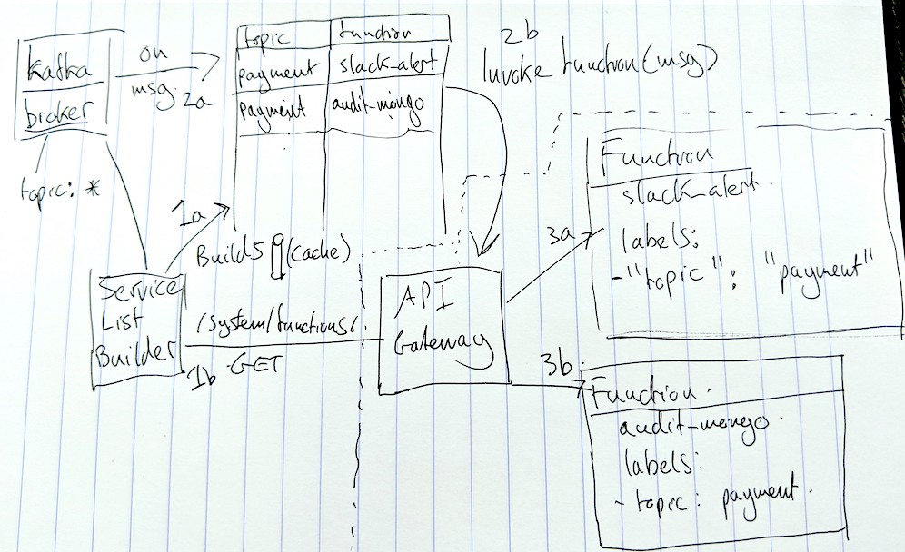

## Kafka-connector

This is a Proof-of-Concept for connecting a number of Kakfa topics to OpenFaaS functions via the API Gateway. 

Goals:

* Allow functions to subscribe to topics
* Ingest data from Kafka
* Work with black-box knowledge of OpenFaaS
* Formulate and validate a generic "connector-pattern" to be used for various event sources like Kafka, AWS SNS, RabbitMQ etc

## Conceptual design



This diagram shows the Kafka connector on the left hand side. It is responsible for querying the API Gateway for a list of functions. It will then build up a map or table of which functions have advertised an interested in which topics.

When the connector hears a message on an advertised topic it will look that up in the reference table and find out which functions it needs to invoke. Functions are invoked only once and there is no re-try mechanism. The result is printed to the logs of the Kafka connector process.

The cache or list of functions <-> topics is refreshed on a periodic basis.

## Try it out

This sample is setup for use on Swarm, but the application code will also work on Kubernetes by using the setup/kubernetes.yml file.

Usage for Swarm:

* Deploy this sample using ./build.sh
* Deploy or update a function so it has an annotation `topic=faas-request` or some other topic

As an example:

```shell
$ faas store deploy figlet --annotation topic="faas-request"
```

The function can advertise more than one topic by using a comma-separated list i.e. `topic=topic1,topic2,topic3`

* Publish some messages to the topic in question i.e. `faas-request`

Instructions are below for publishing messages

* Watch the logs of the kafka-connector

## Trigger a function via a topic with `exec`

You can use the kafka container to send a message to the topic.

```
SERVICE_NAME=kafka_kafka
TASK_ID=$(docker service ps --filter 'desired-state=running' $SERVICE_NAME -q)
CONTAINER_ID=$(docker inspect --format '{{ .Status.ContainerStatus.ContainerID }}' $TASK_ID)
docker exec -it $CONTAINER_ID kafka-console-producer --broker-list kafka:9092 --topic faas-request

hello world
```

## Generate load on the topic

You can use the sample application in the producer folder to generate load for a topic.

Make sure you have some functions advertising an interest in that topic so that they receive the data.

> Note: the producer *must* run inside the Kubernetes or Swarm cluster in order to be able to access the broker(s).

## Monitor the results

Once you have generated some requests or start a load-test you can watch the function invocation rate increasing in Prometheus or watch the logs of the container.

### Prometheus

You can open the Prometheus metrics or Grafana dashboard for OpenFaaS to see the functions being invoked.

### Watch the logs

```
docker service logs kafka_connector -f

Topics
[__consumer_offsets faas-request] <nil>
2018/03/24 12:42:58 Binding to topics: [faas-request]
Rebalanced: &{Type:rebalance start Claimed:map[] Released:map[] Current:map[]}
Rebalanced: &{Type:rebalance OK Claimed:map[faas-request:[0]] Released:map[] Current:map[faas-request:[0]]}

2018/03/24 17:04:40 Syncing topic map
[#53694] Received on [faas-request,0]: 'Test the function.'
2018/03/24 17:04:41 Invoke function: figlet
2018/03/24 17:04:42 Response [200] from figlet  
|_   _|__  ___| |_  | |_| |__   ___   / _|_   _ _ __   ___| |_(_) ___  _ __    
  | |/ _ \/ __| __| | __| '_ \ / _ \ | |_| | | | '_ \ / __| __| |/ _ \| '_ \   
  | |  __/\__ \ |_  | |_| | | |  __/ |  _| |_| | | | | (__| |_| | (_) | | | |_ 
  |_|\___||___/\__|  \__|_| |_|\___| |_|  \__,_|_| |_|\___|\__|_|\___/|_| |_(_)
                  
```


> Note: If the broker has a different name from `kafka` you can pass the `broker_host` environmental variable. This exclude the port.

## Run on Kubernetes

The following instructions show how to run `kafka-connector` on Kubernetes.

Deploy a function with a `topic` annotation:

```bash
$ faas store deploy figlet --annotation topic="faas-request" --gateway <faas-netes-gateway-url>
```

Deploy Kafka:

You can run the zookeeper, kafka-broker and kafka-connector pods with
```
kubectl apply -f setup/kubernetes.yml
```

Then use the broker to send messages to the topic:

```bash
BROKER=$(kubectl get pods -l component=kafka-broker -o name|cut -d'/' -f2)
kubectl exec -t -i $BROKER -- /opt/kafka_2.12-0.11.0.1/bin/kafka-console-producer.sh --broker-list kafka:9092 --topic faas-request

hello world
```
Once you have connected, each new line will be a message published.

If you have an error
```
error: unable to upgrade connection: container not found ("kafka")
```
just wait and retry.

You can verify the proper path of the publisher script by getting the shell of the running broker:
```
$kubectl exec -t -i $BROKER -- sh 
/ # find | grep producer

./opt/kafka_2.12-0.11.0.1/config/producer.properties
./opt/kafka_2.12-0.11.0.1/bin/kafka-verifiable-producer.sh
./opt/kafka_2.12-0.11.0.1/bin/kafka-producer-perf-test.sh
./opt/kafka_2.12-0.11.0.1/bin/kafka-console-producer.sh
```

Now check the connector logs to see the figlet function was invoked:

```bash
CONNECTOR=$(kubectl get pods -o name|grep kafka-connector|cut -d'/' -f2)
tail -f | kubectl logs $CONNECTOR

2018/08/08 16:54:35 Binding to topics: [faas-request]
2018/08/08 16:54:38 Syncing topic map
Rebalanced: &{Type:rebalance start Claimed:map[] Released:map[] Current:map[]}
Rebalanced: &{Type:rebalance OK Claimed:map[faas-request:[0]] Released:map[] Current:map[faas-request:[0]]}

2018/08/08 16:54:41 Syncing topic map
2018/08/08 16:54:44 Syncing topic map
2018/08/08 16:54:47 Syncing topic map

[#53753] Received on [faas-request,0]: 'hello world.'
2018/08/08 16:57:41 Invoke function: figlet
2018/08/08 16:57:42 Response [200] from figlet  
 _          _ _                            _     _ 
| |__   ___| | | ___   __      _____  _ __| | __| |
| '_ \ / _ \ | |/ _ \  \ \ /\ / / _ \| '__| |/ _` |
| | | |  __/ | | (_) |  \ V  V / (_) | |  | | (_| |
|_| |_|\___|_|_|\___/    \_/\_/ \___/|_|  |_|\__,_|
                                                   
```

## Configuration

| env_var               | description                                                 |
| --------------------- |----------------------------------------------------------   |
| `upstream_timeout`      | Go duration - maximum timeout for upstream function call    |
| `rebuild_interval`      | Go duration - interval for rebuilding function to topic map |
| `topics`                | Topics to which the connector will bind                     |
| `gateway_url`           | The URL for the API gateway i.e. http://gateway:8080        |
| `broker_host`           | Default is `kafka`                                          |
| `print_response`        | Default is `false` - this will output the response of calling a function in the logs |

